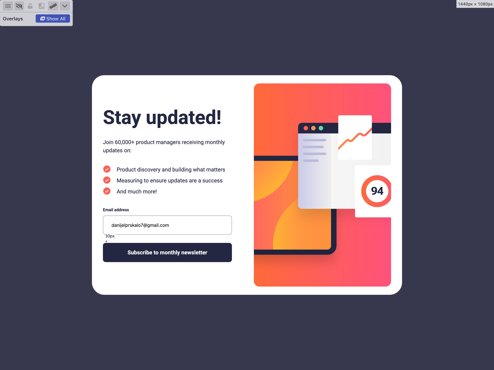

# 🌐 Frontend Mentor - Newsletter Sign-Up Form with Success Message

This is my solution to the [Newsletter Sign-Up Form with Success Message](https://www.frontendmentor.io/challenges/newsletter-signup-form-with-success-message-3FC1AZbNrv) challenge on Frontend Mentor.
These challenges help improve your coding skills by building realistic, hands-on projects. 💻🚀

---

## 📑 Table of Contents

- [🔍 Overview](#-overview)

  - [🖼️ Screenshot](#-screenshot)
  - [🔗 Links](#-links)

- [🛠️ My Process](#-my-process)

  - [🧱 Built With](#-built-with)
  - [📚 What I Learned](#-what-i-learned)
  - [🔄 Continued Development](#-continued-development)

- [👤 Author](#-author)

---

## 🔍 Overview

### 🖼️ Screenshot

### 🔗 Links

- 💡 Solution URL: [Newsletter sign-up form with success message solution URL](https://www.frontendmentor.io/solutions/newsletter-sign-up-form-with-success-message---pure-jscss-rYucYZ9S8A)
- 🌐 Live Site URL: [View Live Site](https://danijel374.github.io/newsletter-signup-form-with-success-message/)

---

## 🛠️ My Process

Before jumping into the code, I took a moment to plan the layout and structure. This made the development process smoother and the codebase more maintainable. ✍️🧠

### 🧱 Built With

- ✅ **Semantic HTML5** markup with proper form structure
- 🎨 **CSS custom properties** for consistent theming
- 🧩 **BEM naming convention** for scalable and maintainable CSS
- 📐 **Flexbox** for alignment and layout
- 🧱 **CSS Grid** for responsive card structure
- 📱 **Mobile-first workflow** with progressive enhancement
- ⚡ **Vanilla JavaScript** with event delegation
- 🎯 **CSS pseudo-elements** for UI enhancements

### 📚 What I Learned

This project didn’t introduce many new concepts, but it was a solid opportunity to reinforce best practices and improve my workflow.

### 🔄 Continued Development

I'm currently focusing on:

- Enhancing responsive design techniques
- Mastering modern layout strategies
- Sharpening my JavaScript skills

---

## 👤 Author

- 🧑‍💻 Frontend Mentor – [@danijel374](https://www.frontendmentor.io/profile/danijel374)
- 🐦 Twitter – [@danijel3741](https://www.twitter.com/danijel3741)

---

Thanks for checking out my solution! 😊

---
